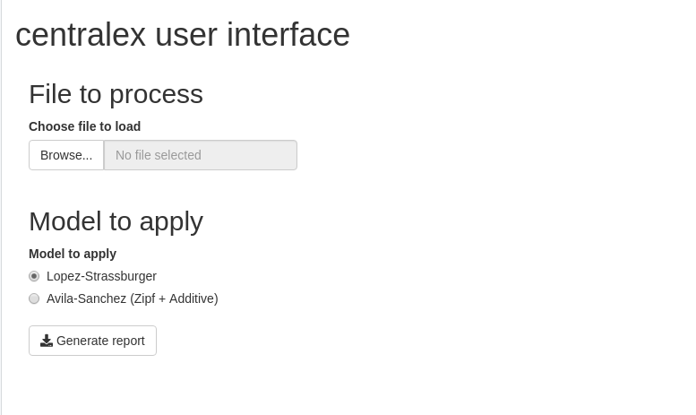

En este documento se presenta una librería de herramientas en lo que pretende ser una guía rápida de uso para el cálculo de la disponibilidad léxica, la centralidad léxica y las diferentes funcionalidades que de esta última se derivan. Aunque la librería permite, a través de programación funcional, implementar múltiples modelos, se proporciona un conjunto de herramientas elementales prediseñadas para que se pueda empezar a usar con las funciones señaladas (disponibilidad, centralidad) de forma casi inmediata. Sin embargo, consideramos necesario hacer notar que estas posibilidades de aplicación directa representan tan solo un subconjunto de las opciones que permite el sistema aquí presentado.

Actualmente está en preparación otro trabajo en el que se discuten en profundidad tanto los modelos posibles y las diferentes opciones de aplicación, como un estudio de diferentes aspectos de las bases teóricas del cálculo de la disponibilidad y su interpretación. Sin embargo, el desarrollo de estas etapas posteriores requiere cierta destreza en el manejo de la sintaxis de R y de conceptos de programación funcional, con lo que su presentación requiere otro ámbito de exposición.

# Exposición y contextualización del sistema

El sistema se ha construido sobre R^[https://www.r-project.org/], una implementación abierta del lenguaje de programación S, que lleva en desarrollo desde 1992 y con una primera versión estable en el año 2000. Es fácilmente extensible y permite la reutilización de código y datos. Se trata de un sistema soportado por una amplia comunidad a lo largo del mundo y se usa de forma habitual en entornos de análisis de datos de ingeniería y medicina. 

RStudio^[https://rstudio.com/] es un entorno comercial de desarrollo para R que permite el uso personal gratuito y que aumenta la productividad en el uso de este lenguaje. Está disponible para la gran mayoría de plataformas y sistemas operativos. Para facilitar el trabajo, se proporcionan utilidades que se pueden ejecutar dentro de este entorno y que facilitan el proceso de análisis.

Es posible utilizar las funcionalidades proporcionadas por nuestro software sin el uso de RStudio, pero consideramos que su empleo se dificulta y se pierden muchas de las posibilidades que proporciona este marco de software.

Dentro del sistema construido en RStudio nos resulta especialmente interesante la posibilidad de usar el paradigma de la _programación literaria_, según la cual, en un mismo documento, se integran tanto los contenidos textuales como la exposición de hechos o la interpretación de los análisis a través de bloques de código que llevan a cabo las manipulaciones y representaciones de datos. Lo que sigue pretende ser un ejemplo práctico del uso de esta metodología. Como muestra de sus ventajas --al incluir en el mismo documento el análisis que se ha llevado a cabo con el código para realizarlo-- se potencia la replicabilidad, característica cada vez más exigida en el mundo académico, en la que se debe permitir que otros investigadores puedan replicar, tanto para verificar como para desarrollar de manera individual, el trabajo expuesto. Este objetivo se cumple al exponer en el mismo documento la disertación y el código con el que se ha realizado los análisis.

A diferencia de soluciones basadas en programas autónomos para el cálculo de la disponibilidad léxica, la implementación de esta solución dentro de un sistema como el formado por R junto con RStudio permite, además, la integración de todo el procedimiento de gestión de datos. De esta forma, los resultados obtenidos a partir de las herramientas proporcionadas se incorporan al sistema, con lo que se permite la integración en nuevos procesos de datos y la aplicación personal de los resultados obtenidos.

La distribución de las soluciones es otro problema que ya ha encontrado soluciones eficientes dentro de la comunidad de usuarios de `R`. Repositorios de código como GitHub permiten la gestión y el control automatizado de versiones. Es posible llevar a cabo un control exhaustivo de las modificaciones que se van realizando, sin necesidad de descargar e instalar continuamente programas. Con dos líneas de código podemos estar seguros de tener instalada la última versión disponible. Además, este modelo de intercambio de código permite que los proyectos no desaparezcan, ya que se pueden crear ramas de cualquier repositorio de código para continuar su desarrollo, independientemente de los creadores originales.

Entre las múltiples herramientas construidas sobre `R` hemos considerado muy interesantes y productivas las herramientas que conforman el "Universo Tidyverse"^[https://www.tidyverse.org/]. Se trata de un conjunto de librerías que facilitan y permiten una manipulación expresiva de los datos, basada en el concepto de tubería. Este tratamiento se construye mediante la secuenciación de manipulaciones que se van encadenando, de manera que el resultado de una etapa se convierte en la fuente de datos para la siguiente. Esta característica, junto con operadores adaptados a este tipo de trabajo, proporciona una expresividad potente y cómoda de llevar a cabo transformaciones que, de otra forma, serían muy complejas. Las manipulaciones de datos presentadas en este trabajo se realizan utilizando estas herramientas.


# Instalación

## Prerequisitos

En primer lugar es necesario instalar el sistema `R`. Para ello se accede, en la sección *Download* de la página del proyecto, [https://www.r-project.org/](https://www.r-project.org/), al enlace [CRAN](http://cran.r-project.org/mirrors.html), seleccionar un sitio --en nuestro caso vamos a escoger el de la Red Iris, que es una réplica local en España [https://cran.rediris.es/](https://cran.rediris.es/)-- y, en la página principal encontramos un enlace para descargar la versión para nuestro sistema operativo. En el caso de elegir la versión para Windows, se elegiría la versión `base` y accedemos, finalmente, al binario que instala el sistema, que en este momento, corresponde a la versión `4.0.2`, en el enlace (https://cran.rediris.es/bin/windows/base/R-4.0.2-win.exe)[https://cran.rediris.es/bin/windows/base/R-4.0.2-win.exe].


A continuación se recomienda, aunque no es estrictamente necesario, instalar el entorno de productividad `RStudio`. En (https://rstudio.com/)[https://rstudio.com/], siguiendo, en este momento, el camino `Product` > `Open Source` > `RStudio`, se llega a la página de descripción del producto, del que hay dos versiones: `Desktop` y `Server`. En nuestro caso usaremos la versión `Desktop`, en su versión _Open Source Edition_, que se puede descargar en (https://rstudio.com/products/rstudio/download/)[https://rstudio.com/products/rstudio/download/]. La versión actual para Windows se encuentra en (https://download1.rstudio.org/desktop/windows/RStudio-1.3.1073.exe)[https://download1.rstudio.org/desktop/windows/RStudio-1.3.1073.exe].


## dispocen

Una vez instalados los prerequisitos, para poder utilizar las herramientas que proponemos, el usuario debe llevar a cabo un segundo paso de instalación que, en nuestra opinión, no es más complejo que cualquier proceso de instalación en el sistema _R_. Este paso ha de hacerse únicamente cuando se pretenda instalar o actualizar el paquete en el sistema. Puesto que nuestra intención es seguir trabajando en el paquete, sería recomendable realizar esta acción de forma periódica.

Las siguientes órdenes instalan el paquete _dispocen_ desde el repositorio _GitHub_. Todo el código está implementado en _R_, con lo que es fácil de revisar.
```{r eval=FALSE}
install.packages("devtools")
library(devtools)
install_github("jmss70/dispocen")
```

Para facilitar la introducción de la herramienta se han impuesto como requerimientos, para que se instalen de forma automática, las herramientas del universo _Tidyverse_, que facilitan el procesamiento de datos y se usa de forma extensiva en este y otros trabajos, y la librería _flextable_ y _kableExtra_, con el objetivo de mejorar la presentación de las tablas.


Una vez que se han llevado a cabo los pasos anteriores, y si no se ha producido ningún contratiempo, el sistema está preparado para ejecutar el cálculo de los índices de disponibilidad y centralidad.

# Carga de las librerías y los datos

Para poder usar las librerías hay que cargarlas en nuestra sesión de trabajo. De esta manera se ponen a disposición del usuario las funciones que proporcionan.
```{r message = FALSE, warning = FALSE}
library(dispocen)
```

El formato requerido de los datos coincide con el tradicionalmente usado por los programas más empleados hasta ahora para el cálculo de la disponibilidad léxica (__Lexidisp__, __Dispolex__, esencialmente). Sin embargo, consideramos que parte de la información que contiene su estructura es redundante y sería conveniente plantear la posibilidad de establecer un estándar de codificación que sea más coherente con los modelos de datos normalizados.


De momento, se espera que los datos estén en un archivo de texto, con campos separados por espacios, según el siguiente formato: 

* Un campo con información sociológica básica del hablante formada por cinco caracteres sucesivos. Cada uno de ellos representa la codificación de una variante dentro de una variable sociológica
* Un campo de identificación del usuario de tres caracteres
* Un campo de identificación del centro de interés de dos caracteres
* Una lista de palabras separadas por comas y siguiendo el orden de su aparición en las listas originales. Es necesario que no se utilice el carácter "coma" como valor de un elemento, ya que se interpretaría como separador.

Un ejemplo de dos líneas sería:

    21131 001 01 mano, pie, brazo, cerebro, pulmón, nariz, extremidad, ojo, boca, diente, pelo, oreja, culo, vagina 
    12131 002 01 riñón, corazón, garganta, cabeza, pierna, pie, hígado, estómago, mano, brazo, antebrazo, abdomen, pecho, ojo, boca, oído, dedo, rodilla, costilla 

Suponiendo que tenemos todos los datos cargados en un archivo, denominado `datos.txt`, que estará alojado en el mismo directorio que el script de procesamiento, se podrían cargar los datos como:
```{r}
data <- read.dispocen("datos.txt")
data %>% 
  head() %>% 
  flextable() %>% autofit() %>%
  theme_booktabs()
```


# Cálculo de la disponibilidad

La función general del cálculo de la disponibilidad es `build.availability`. Sin embargo, el uso de esta función requiere del uso de varios parámetros. Se han construidos dos funciones de utilidad que encapsulan su uso y ofrecen los dos modelos que consideramos, por el momento, más interesantes (Modelo López-Strassburger y Modelo Ávila-Sánchez). Consideramos que es preferible exponer su uso mediante ejemplos.

## Modelo de López-Strassburger


Este modelo, que es el más conocido y el último de una serie de iteraciones para la cuantificación de la disponibilidad, se puede usar como:
```{r}
disponibilidad <- build.lopezstrass.availability(data)
```
El resultado es un nuevo marco de datos cuyos campos son el centro de interés, la palabra y la disponibilidad calculada, junto con otros datos necesarios para su obtención como la posición y las frecuencias relativas y acumuladas dentro del centro de interés:
```{r}
head(disponibilidad) %>%
  flextable() %>% 
  set_header_labels(centers = "Centro de interés", 
                    words="Palabra", 
                    order="Orden", 
                    availability="Disponibilidad", 
                    freq.abs="Frecuencia absoluta", 
                    freq.abs.cum="Frecuencia absoluta acumulada", 
                    freq.rel="Frecuencia relativa", 
                    freq.rel.cum="Frecuencia relativa acumulada") %>%
  colformat_num(j=c(4,6,8), digits=6) %>%
  width(j=c(1,3,5,7),width=.65) %>%
  width(j=c(2,4,6,8),width=.9) %>%
  theme_booktabs()
```
Al ser un marco de datos de _R_ estándar, se pueden realizar sobre él todas las operaciones que permite el sistema. En el siguiente ejemplo hemos seleccionado los resultados obtenidos en el centro de interés "03", los hemos ordenado en orden decreciente de disponibilidad y mostramos los 10 vocablos más disponibles
```{r}
disponibilidad %>% 
  filter(centers=="03") %>% 
  arrange(-availability) %>% 
  head(10) %>%
  flextable() %>% 
  set_header_labels(centers = "Centro de interés", 
                    words="Palabra", 
                    order="Orden", 
                    availability="Disponibilidad", 
                    freq.abs="Frecuencia absoluta", 
                    freq.abs.cum="Frecuencia absoluta acumulada", 
                    freq.rel="Frecuencia relativa", 
                    freq.rel.cum="Frecuencia relativa acumulada") %>%
  colformat_num(j=c(4,6,8), digits=6) %>%
  width(j=c(1,3,5,7),width=.65) %>%
  width(j=c(2,4,6,8),width=.9) %>%
  theme_booktabs()
```
También es posible utilizar los mecanismos de _R_ para representar la curva de disponibilidad, esto es, la sucesión de valores de disponibilidad, una vez ordenados en valor decreciente de disponibilidad:
```{r}
disponibilidad %>% 
  filter(centers=="03") %>% 
  arrange(-availability) %>% 
  ggplot(aes(x=order, y=availability)) + geom_line() +
  xlab("Sucesión de palabras") + ylab("Disponibilidad") +
  theme_bw() + scale_colour_grey()
```

## Modelo de Ávila-Sánchez

Ávila y Sánchez (2014 Fuzzy sets and Prototype Theory: Representational model of cognitive community structures based on lexical availability trials) propusieron un macro-modelo para el estudio de la disponibilidad léxica a partir de la Teoría de los Conjuntos Difusos y mediante la modelización de los conceptos que se pretenden representar. Esta modelización se produce en dos etapas. En la primera, se cuantifica la relevancia de cada término en las pruebas obtenidas para cada hablante y centro de interés según una ley descendente según se avanza en cada listado, y en la segunda etapa se integra esa información con una ley aditiva que considera los distintos valores alcanzados para cada palabra en cada centro de interés.

Hay múltiples posibles elecciones, pero en distintas pruebas resultaron más prometedoras las que utilizaban en la primera etapa una ley de Zipf-Mandelbrot y en la segunda una adición probabilística. La interpretación de los valores obtenidos corresponde al concepto de  ‘centralidad’ de cada término en cada centro de interés. Un valor de 1, o muy cercano, respondería a la pertenencia al núcleo del vocabulario específico del centro de interés, mientras que un valor próximo a 0 indicaría que se trataría de un término poco accesible y, por tanto, descentralizado.

La función que lleva a cabo este análisis, `build.avilasanchez.availability`, se utiliza de la misma forma que la mostrada anteriormente en el modelo López-Strassburger:

```{r}
disponibilidad <- build.avilasanchez.availability(data)
```


El resultado es, de igual modo, un nuevo marco de datos con la disponibilidad de cada término en cada centro de interés
```{r}
disponibilidad %>% 
  filter(centers=="03") %>% 
  arrange(-availability) %>% 
  head(10) %>% 
  flextable() %>%
  set_header_labels(centers = "Centro de interés", 
                    words="Palabra", 
                    order="Orden", 
                    availability="Disponibilidad", 
                    freq.abs="Frecuencia absoluta", 
                    freq.abs.cum="Frecuencia absoluta acumulada", 
                    freq.rel="Frecuencia relativa", 
                    freq.rel.cum="Frecuencia relativa acumulada") %>%
  colformat_num(j=c(4,6,8), digits=6) %>%
  width(j=c(1,3,5,7),width=.65) %>%
  width(j=c(2,4,6,8),width=.9) %>%
  theme_booktabs()
```
Que se puede procesar como cualquier marco de datos del sistema _R_:
```{r}
disponibilidad %>% 
  filter(centers=="03") %>% 
  arrange(-availability) %>% 
  ggplot(aes(x=order, y=availability)) + geom_line() +
  xlab("Sucesión de palabras") + ylab("Disponibilidad") +
  theme_bw() + scale_colour_grey()
```

Debido a las características de los operadores aditivos de la teoría de los conjuntos difusos, es posible que la forma de la curva obtenida para el cálculo de la disponibilidad clásica: quizás no aparezcan términos con valores cercanos a 1 (por ejemplo, si se tienen pocos datos y estos son relativamente dispersos) o, por el contrario, encontremos demasiados términos con valoraciones cercanas a 1 (por ejemplo, si se trabaja con muchas muestras). Aunque las opciones anteriores son improbables, pero posibles, hemos optado por regular la curva mediante un parámetro adicional, `k`, que va a modificar la curva (ascendente-descendente), pero manteniendo su forma y clasificación. El valor por defecto de `k` es 1. Si se da un valor entre 0 y 1, la curva bajará (menos términos con valores cercanos a 1), mientras que si a `k` se le da un valor mayor que la unidad la curva subirá (más términos cercanos a la unidad).

```{r}
disponibilidad <- build.avilasanchez.availability(data, k = 0.1)
disponibilidad %>%
  filter(centers=="03") %>% 
  arrange(-availability) %>% 
  ggplot(aes(x=order, y=availability)) + geom_line() +
  xlab("Sucesión de palabras") + ylab("Disponibilidad") +
  theme_bw() + scale_colour_grey()
```

El resultado final será, en cualquier caso, un nuevo marco de datos con la disponibilidad de cada término en cada centro de interés
```{r}
disponibilidad <- build.avilasanchez.availability(data, k = 2)
disponibilidad %>%
  filter(centers=="03") %>% 
  arrange(-availability) %>% 
  ggplot(aes(x=seq_along(availability), y=availability)) + geom_line() +
  xlab("Sucesión de palabras") + ylab("Disponibilidad") +
  theme_bw() + scale_colour_grey()
```

Téngase en cuenta que los ejemplos mostrados representan de forma artificial, manipulada y consciente, valores muy extremos usados a modo de exposición. En nuestras pruebas, realizadas siempre con datos reales procedentes de investigaciones previas, hemos encontrado que el valor de referencia ofrece resultados adecuados en todos los casos que hemos encontrado.

# Niveles de disponibilidad

Una pregunta recurrente en casi todos los estudios previos de disponibilidad léxica es considerar cuál es el tamaño del conjunto de elementos que se habría que considerar para establecer el núcleo de un centro de interés. Para responder a esta cuestión, y a partir del nuevo marco teórico creado en nuestra propuesta, se proporciona una herramienta que etiqueta los términos por niveles de centralidad. El nivel 0 correspondería a aquellos elementos que no pertenecen al núcleo, es decir, aquellos términos que no son generalmente accesibles. Los níveles 1, 2, 3, … y sucesivos representarían un mayor grado de centralidad y aproximación al centro de interés.

```{r}
disponibilidad <- build.avilasanchez.availability(data)
levels <- classify.availability.levels(disponibilidad)
levels %>% 
  head(20) %>%
  arrange(-availability) %>%
  select(-order) %>%
  flextable() %>%
  set_header_labels(centers = "Centro de interés", 
                    words="Palabra", 
                    availability="Disponibilidad",
                    level="Nivel de disponibilidad",
                    cutlevel="Nivel de corte",
                    freq.abs="Frecuencia absoluta", 
                    freq.abs.cum="Frecuencia absoluta acumulada", 
                    freq.rel="Frecuencia relativa", 
                    freq.rel.cum="Frecuencia relativa acumulada") %>%
  colformat_num(j=c(5,7,9), digits=5) %>%
  width(j=c(1,4,6,8),width=.65) %>%
  width(j=c(2,3,5,6,7,9),width=.75) %>%
  theme_booktabs()
```

```{r}
levels %>% 
  filter(centers=="01") %>% 
  arrange(-availability)   %>% 
  filter(level > 0) %>%
  select(-order) %>% 
  flextable() %>% 
  set_header_labels(centers = "Centro de interés", 
                    words="Palabra", 
                    availability="Disponibilidad",
                    level="Nivel de disponibilidad",
                    cutlevel="Nivel de corte",
                    freq.abs="Frecuencia absoluta", 
                    freq.abs.cum="Frecuencia absoluta acumulada", 
                    freq.rel="Frecuencia relativa", 
                    freq.rel.cum="Frecuencia relativa acumulada") %>%
  colformat_num(j=c(3,5,7,9), digits=5) %>%
  width(j=c(1,4,6,8),width=.65) %>%
  width(j=c(2,3,5,6,7,9),width=.75) %>%
  theme_booktabs()
```

Con esta información se puede construir una representación en la que se observa la distribución de las disponibilidades en el centro de interés y los diferentes conjuntos de cortes.

```{r}
levels %>%
  filter(centers=="04") %>% 
  mutate(level=factor(level)) %>% 
  arrange(-availability) %>% 
  ggplot(aes(x=order,y=availability,color=level)) + geom_line() +
  xlab("Posición del término en el centro de interés") +
  ylab("Disponibilidad") +
  theme_bw() + scale_colour_grey()
```


Se han construido utilidades para ayudar a la representación de estos conjuntos de cortes. El siguiente ejemplo muestra los principales conjuntos de corte obtenidos en los 16 centros de interés usados en el trabajo de Villena Ponsoda y Ávila Muñoz (2010)


```{r}
clasificacion <- build.availability.levels(levels)
clasificacion %>% 
  filter(level> 0)  %>%
  flextable() %>% 
  set_header_labels(centers = "Centro de interés", 
                    words="Palabras", 
                    level="Nivel de disponibilidad",
                    count="Recuento") %>%
  width(j=c(1,2,3),width=.75) %>%
  width(j=4,width=4) %>%
  align(i=4,align="right") %>%
  theme_booktabs()
```


```{r}
levels %>%
  mutate(level=factor(level)) %>% 
  filter(centers %in% c("01","02","03","04")) %>%
  arrange(-availability) %>% 
  ggplot(aes(x=order,y=availability,color=level)) + geom_line() + facet_wrap(~centers)  +
  xlab("Secuencia de palabras (por grado descendente de compatibilidad)") + 
  ylab("Disponibilidad") +
  theme_bw() + scale_colour_grey()
```

# Herramienta propuesta

Para facilitar el acceso a esta herramienta se ha dispuesto una pequeña utilidad gráfica que construye un documento básico con construcciones que opinamos que cubren las necesidades generales para el estudio de la disponibilidad. Este documento puede ser fácilmente modificable para adaptarlo a las necesidades de cada usuario. 

Incluyendo la carga de la librería se puede invocar como:

```{r eval=FALSE}
library(dispocen)
dispocen::runUtility()
```
abriéndose un interfaz gráfico con el siguiente aspecto:

Proporcionado un archivo de datos, seleccionado el modelo de procesamiento (inicialmente se proporcionan dos opciones, el modelo de disponibilidad propuesto por López-Strassburger y el de centralidad propuesto por Ávila-Sánchez) se confirman los datos y se ofrece la descarga de un documento que ha de guardarse junto al archivo de datos. 

Este documento incluye los bloques de código que llevan a cabo los procedimientos que hemos considerado útiles y que ofrecen sus resultados en el formato expuesto en este trabajo. Muchos bloques están etiquetados con la opción `eval=FALSE`, que hace que no se ejecuten por defecto. Si se está interesado en los resultados correspondientes, tan sólo hay que eliminar esa opción.

Se proporcionan las siguientes secciones:

* Carga de datos y modelo de disponibilidad: estas secciones son imprescindibles, o no se podría lleva a cabo el análisis. Se proporcionan una serie de bloques que permiten exponer los datos obtenidos por centro de interés, en forma de tabla y de gráfico, y un resumen gráfico de todos los centros de interés.
* Niveles de centralidad/disponibilidad: se clasifican las palabras por niveles y se construyen los listados de términos por nivel. Se posibilita obtener los listados con la clasificación y otros datos asociados y las tablas resumen. Se han habilitado por defecto la presentación de los niveles de los términos por encima del nivel básico, de menor centralidad.

Nótese que este documento es un documento RMarkdown que es fácilmente modificable y personalizable. Se procesa entonces, dando lugar a un documento PDF, Word o HTML, entre otras opciones, que puede utilizarse como base para completar el trabajo.

# Ejemplos de uso

Hemos decidido, de forma predeterminada, no considerar el uso de las primeras columnas para datos sociológicos en los datos porque su limitado formato y redundancia no constituye una buena práctica, siguiendo los criterios de la normalización de bases de datos y de análisis de datos.

Así, presentamos algunas propuestas que consideramos más productivas para llevar a cabo estos datos.

## Los datos sociológicos

En primer lugar, es importante evitar la redundancia de los datos, tanto por la dificultad que implica mantener la coherencia de los mismos cuando se encuentran duplicados en varios lugares como por facilitar mantenerlos actualizados.

```{r}
bs <- read.csv("BaseSociologica.csv", colClasses = "character")
bs <- bs %>%
  mutate(EDAD=strtoi(EDAD),
         AÑOSDEESTUDIO = strtoi(AÑOSDEESTUDIO))
```

```{r}
bs %>%
  head()  %>%
  select(SUJETO,SEXO,EDAD,AÑOSDEESTUDIO) %>%
  flextable() %>%
  autofit()
```


## Análisis separados por sexo

Si se desea llevar a cabo un análisis de centralidad léxica, separados por sexos, se pretende llevar a cabo la integración de la información proporcionada por hombres y mujeres. Así que se filtrarían las realizaciones a procesar seleccionando a los sujetos que cumplen esas características:
```{r}
idHombres <-
  bs %>% 
  filter(SEXO=="1") %>%
  select(SUJETO) %>%
  unlist()
idHombres
```

```{r}
idMujeres <-
  bs %>% 
  filter(SEXO=="0") %>%
  select(SUJETO) %>%
  unlist()
idMujeres
```
Entonces, se pueden separar las realizaciones, si los sujetos pertenecen al grupo de hombres o mujeres
```{r}
data %>% 
  filter(users %in% idMujeres) %>%
  head()
```

```{r}
data %>% 
  filter(users %in% idHombres) %>%
  head()
```

Y se pueden procesar de la forma habitual:
```{r}
disponibilidadHombres <- 
  build.avilasanchez.availability(data %>%
                                  filter(users %in% idHombres))
head(disponibilidadHombres) %>%
  select(centers, words, availability) %>%
  flextable() %>%
  autofit()
```

```{r}
disponibilidadMujeres <- 
  build.avilasanchez.availability(data %>%
                                  filter(users %in% idMujeres))
head(disponibilidadMujeres) %>%
  select(centers, words, availability) %>%
  flextable() %>%
  autofit()

```
Esta información se puede combinar para realizar análisis comparativos, enlazando los datos por centros de interés y términos
```{r}
dispComp <-
  inner_join(disponibilidadHombres %>% 
             select(centers,words,availability) %>%
             rename(avHombres=availability), 
             disponibilidadMujeres %>%
             select(centers,words,availability) %>%
             rename(avMujeres=availability),
           by = c("centers", "words"))
dispComp %>%
  head() %>%
  flextable() %>%
  autofit()
```

```{r}
dispComp %>%
  ggplot(aes(x=avHombres,y=avMujeres,color=centers)) + geom_point() +
  theme_bw() + scale_colour_grey()
```

Según este gráfico es posible observar que los términos muy disponibles y poco disponibles tienden a ser similares. Sin embargo, los términos que aparecen en los diversos niveles intermedios pueden variar de forma muy significativa.
```{r}
levelsHombres <- classify.availability.levels(disponibilidadHombres)
clasificacionHombres <- build.availability.levels(levelsHombres)
levelsMujeres <- classify.availability.levels(disponibilidadMujeres)
clasificacionMujeres <- build.availability.levels(levelsMujeres)
clasificacionSexo <-
  inner_join(clasificacionHombres %>%
               select(centers,level,words) %>%
               rename(wordsHombres=words),
             clasificacionMujeres %>%  
               select(centers,level,words) %>%
               rename(wordsMujeres=words), 
           by=c("centers","level")) 
  
clasificacionSexo %>%
  filter(level> 0)  %>%
  flextable() %>% 
  set_header_labels(centers = "Centro de interés", 
                    wordsHombres="Palabras hombres", 
                    wordsMujeres="Palabras mujeres", 
                    level="Nivel de disponibilidad",
                    count="Recuento") %>%
  width(j=c(1,2),width=.75) %>%
  width(j=c(3,4),width=2.5) %>%
  align(j=c(3,4),align="right") %>%
  theme_booktabs()
```

Mediante un diagrama de puntos, en el que se representan en cada eje las disponibilidades para hombres y mujeres, pero sólo de aquellos términos que no se han clasificado en el mismo nivel, y etiquetando por diferencia de nivel, se obtendría:
```{r}
levelsSexo <-
  inner_join(levelsHombres %>%
               select(centers,level,words,availability) %>%
               rename(avHombre=availability,levelHombre=level),
             levelsMujeres %>%  
               select(centers,level,words,availability) %>%
               rename(avMujer=availability,levelMujer=level), 
           by=c("centers","words")) 
levelsSexo %>%
  filter(levelHombre != levelMujer) %>%
  mutate(diffLevel=factor(abs(levelHombre-levelMujer))) %>%
  ggplot(aes(x=avHombre,y=avMujer,color=diffLevel)) + geom_point() +
  theme_bw() + scale_colour_grey()
```

Se puede observar que en la mayor parte de los casos en los que se clasifican en niveles distintos, lo hacen con poca diferencia. 
```{r}
diffs <- tapply(levelsSexo$levelHombre == levelsSexo$levelMujer, 
                levelsSexo$centers, 
                mean) * 100 
diffs
```
```{r}
summary(diffs)
```
De hecho, se puede observar que el porcentaje de términos clasificados en el mismo nivel en cada centro de interés va entre el 57  y el 74 por ciento.

